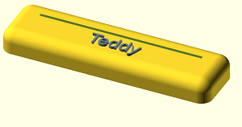
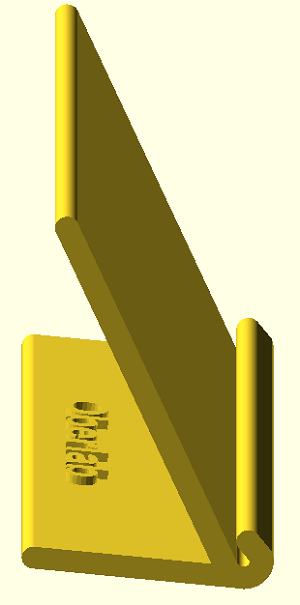
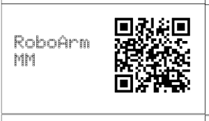

# LAB-Tools
Platinenhalter, QR-Ständer und Beschriftung

  |[:skull:ISSUE](https://github.com/frankyhub/LAB-Tools/issues?q=is%3Aissue)|[:speech_balloon: Forum /Discussion](https://github.com/frankyhub/LAB-Tools/discussions)|[:grey_question:WiKi](https://github.com/frankyhub/LAB-Tools/wiki)|
|--|--|--|
| | | |
||||
||| |

---

---

   
<ol class="breadcrumb" style="border-top: 2px solid black;border-bottom:2px solid black; height: 45px; width: 900px;"> 
<a href="#oben">nach oben</a>
</ol>

  

---

